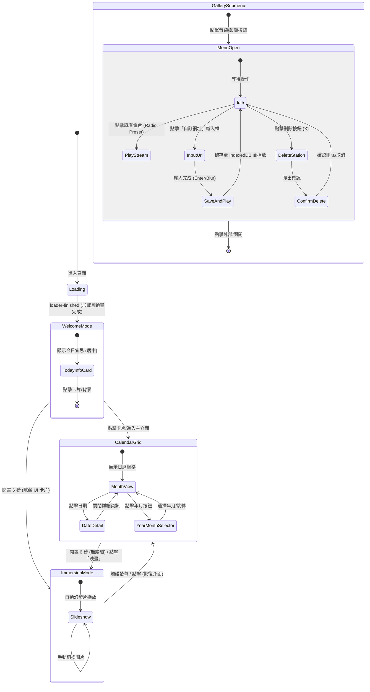
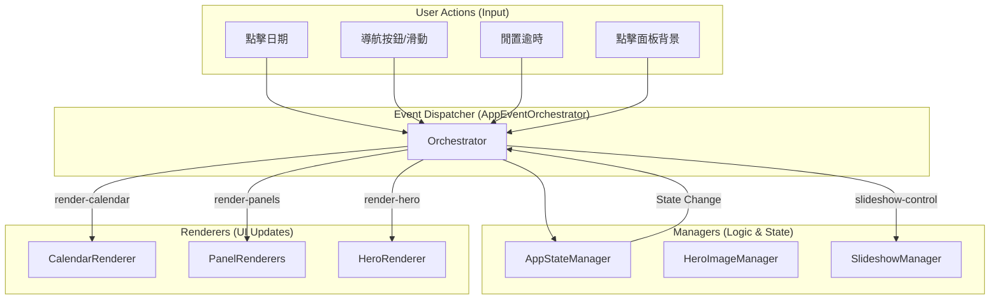
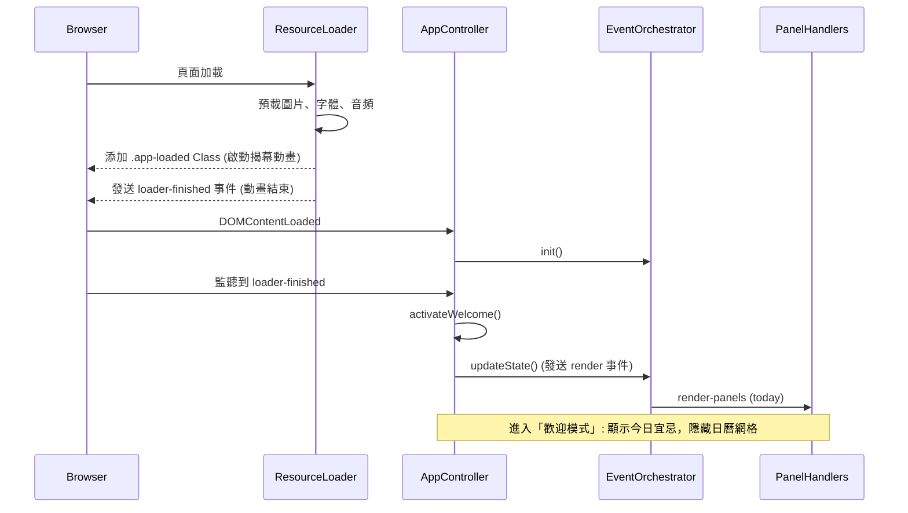

# UI Flow & Logic Architecture (UI 流程與邏輯架構)

本文件使用 Mermaid 圖表描述專案的 UI 狀態流轉與事件驅動邏輯。

## 1. 核心狀態流轉圖 (Core State Lifecycle)

## 2. 事件驅動架構 (Event-Driven Architecture)

應用程式採用解耦的事件驅動模型，由 `EventOrchestrator` 擔任指揮官。

## 3. 初始化流程 (Initialization Sequence)

## 4. 文件維護說明
- **Mermaid 工具**: 建議使用 VS Code 的 Mermaid Preview 擴充功能查看。
- **邏輯變更**: 若修改 `src/scripts/app/` 下的控制項，請同步更新此圖表。
