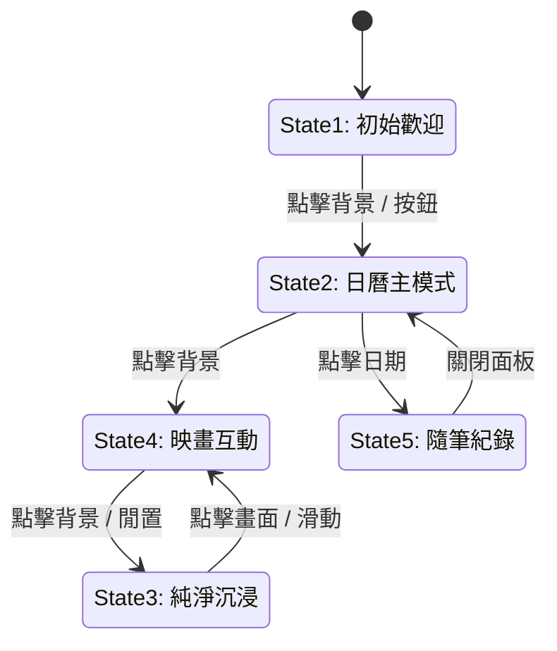

# UI Flow & Logic Architecture (UI 流程與邏輯架構)

此文件描述 "Lunar Calendar" 專案的核心 UI 狀態流轉、互動邏輯與設計哲學。

## 1. 五大核心狀態 (The 5 Core States)

本專案明確定義了五種使用者操作狀態，建構完整的心智模型 (Mental Model)：

### **狀態 1: 初始歡迎 (Initial State)**

- **畫面**: 全螢幕背景 + **今日詳情卡片** (紅卡)。
- **邏輯**: 程式啟動時的預設入口 (`initial-welcome`)。
- **顯示**: 隱藏底部 Dock 與導航，僅顯示中央卡片與背景。
- **流轉**:
    - 點擊右上角「日曆圖示」或畫面任意處 $\rightarrow$ **狀態 2 (日曆)**。

### **狀態 2: 日曆主模式 (Calendar State)**

- **畫面**: **日曆網格 (Grid View)** + 年月導航。
- **邏輯**: 資訊查詢的主模式，亦為預設工作區。
- **顯示**:
    - 顯示日曆網格、年月選擇器。
    - **註**: 此模式下隱藏頂部切換按鈕 (Toggle Button)，保持畫面純淨。
- **流轉**:
    - 點擊日曆背景 $\rightarrow$ **狀態 4 (映畫)**。
    - 點擊日期 $\rightarrow$ **狀態 5 (隨筆/詳情)**。

### **狀態 3: 純淨沉浸 (Zen State)**

- **畫面**: **純背景** (無底部 Dock，無導航按鈕，無資訊條)。
- **邏輯**: 視覺享受與環境氛圍模式 (Ambience Mode)。
- **顯示**: 隱藏所有 UI 元素 (Dock, Header, Floating Buttons, Panels)。
- **流轉**:
    - 從 **狀態 4** 閒置一段時間後自動進入，或在歡迎模式後自動進入。
    - 點擊畫面/互動 $\rightarrow$ **狀態 4 (映畫)**。

### **狀態 4: 映畫互動 (Artwork State)**

- **畫面**: 全螢幕背景 + **底部 Dock** + **頂部 Header (資訊條)** + **右上工具按鈕**。
- **邏輯**: 互動式背景賞析模式。
- **顯示**:
    - 顯示底部 Dock (HeroDock) 用於切換圖片或音樂。
    - 顯示頂部資訊條。
    - 側邊顯示「切換日曆」按鈕。
- **流轉**:
    - 點擊畫面中央/背景 $\rightarrow$ **狀態 3 (純淨)**。
    - 點擊「切換日曆」按鈕 $\rightarrow$ **狀態 2 (日曆)**。

### **狀態 5: 隨筆紀錄 (Note State)**

- **畫面**: **隨筆面板 (PanelToday)** (包含輸入框、字體選擇、匯出)。
- **邏輯**: 專注於寫作與記錄的模式。
- **顯示**: 覆蓋於當前背景之上，顯示完整筆記功能。
- **流轉**:
    - 關閉面板 (Close) $\rightarrow$ 回到 **狀態 2 (日曆)**。

---

## 2. 狀態流轉圖 (State Lifecycle)

## 3. 關鍵互動邏輯 (Interaction Logic)

### 3.1 視圖切換 (Mode Switching)

- **按鈕**: `btnHeaderToggle` (頂部左側)。
- **行為**:
    - **在狀態 2 (日曆)**: 預設**隱藏**。使用者透過點擊背景進入狀態 4。
    - **在狀態 4 (映畫)**: 預設**隱藏**。

### 3.2 沉浸循環 (Immersion Loop)

- **Zen <-> Artwork**:
    - 這兩個狀態形成一個 "觀賞循環"。
    - **Zen (State 3)**: 提供無干擾的觀賞體驗。
    - **Artwork (State 4)**: 提供必要的控制功能 (換圖、音樂)。
    - 兩者透過點擊背景輕鬆切換。

---

## 4. 事件驅動架構 (Event Orchestration)

系統使用 `CustomEven` 進行狀態通知：

| 事件名稱 (Event)    | 參數 (Detail)                               | 描述                                |
| :------------------ | :------------------------------------------ | :---------------------------------- |
| `welcome-mode`      | `{ active: false, targetMode: 'calendar' }` | **強制進入狀態 2** (日曆主模式)。   |
| `welcome-mode`      | `{ active: true }`                          | **進入狀態 4** (映畫模式)。         |
| `close-panels`      | `{ showGrid: true }`                        | 關閉浮動層並顯示網格 (輔助狀態 2)。 |
| `slideshow-control` | `{ action: 'start', isArtwork: true }`      | 啟動輪播並顯示 Dock (輔助狀態 4)。  |

## 5. UI 層級規範 (Z-Index Hierarchy)

1.  **Bottom**: HeroBackground (`z-index: 1`)
2.  **Middle**: HeroHeader / Dock (`z-index: 2000`)
3.  **Top**: Floating Panels (Today/Note) (`z-index: 2200`)
4.  **Overlay**: WelcomeOverlay (`z-index: 100005`, 僅用於狀態 1)

## 6. 最近 UX 更新與細節優化 (Recent UX Refinements)

### 6.1 自選圖片空狀態 (Custom Gallery Empty State)

- **觸發條件**: 使用者切換至「自選圖片 (Custom)」模式，但尚未匯入任何圖片。
- **行為**:
    - **背景**: 強制顯示特定 Fallback 圖片 (`assets/gallery/default/1.png`)，通常為模糊磨砂背景。
    - **提示**: 在選單內或 Dock 上方顯示紅色警告框 (`.gallery-empty-notice`)：「⚠️ 尚無自選圖片，請先匯入」。
    - **引導**: 自動開啟圖片管理選單，方便使用者立即匯入。

### 6.2 音樂狀態恢復 (Music State Restoration)

- **機制**: 利用 `localStorage` (`zen_music_last_url`) 記憶上次播放的來源。
- **流程**:
    1.  應用程式啟動 (`MusicPlayer.init`)。
    2.  讀取上次 URL。
    3.  若存在，自動設定 `audio.src` 並處於**準備就緒**狀態 (Ready to Play)。
    4.  發送 `music-restored` 事件，同步更新 UI 選項 (Highlight Active Station)。

### 6.3 年月選擇器排版 (Selector Layout)

- **年份**: 改為 **10** 年顯示 (5 欄 x 2 列)，聚焦於當前年份前後範圍。
- **月份**: 改為 **12** 個月顯示 (4 欄 x 3 列)，符合視覺平衡。

### 6.4 沉浸模式滑動 (Zen Mode Swipe)

- **問題**: 舊版在 UI 隱藏 (Zen Mode) 時無法滑動切換圖片。
- **修正**: 導航邏輯 (`NavigationHandler`) 現在接受 `immersion-mode` 作為有效狀態。
- **結果**: 無論 UI 是否顯示，全螢幕狀態下皆可左右滑動切換背景。

### 6.5 手機版 Header Toggle 優化

- **修正**: 同時監聽 `click` 與 `touchstart`。
- **機制**: `touchstart` 觸發後立即執行並呼叫 `preventDefault()`，阻止後續的 Ghost Click，確保操作靈敏且穩定。

### 6.6 平滑主題轉換 (Smooth Theme Transition)

- **視覺效果**: 針對背景色、文字色、邊框色等關鍵視覺屬性，加入 **0.6s** 的緩動過渡 (`cubic-bezier(0.22, 1, 0.36, 1)`)。
- **目的**: 消除主題或季節切換時的生硬閃爍感，營造如呼吸般的自然流動體驗。

### 6.7 沉浸模式手勢引導 (Zen Mode Gesture Hint)

- **觸發**: 使用者**首次**進入沉浸模式 (Zen Mode) 時。
- **UI**: 顯示半透明的手指滑動動畫與文字提示「左右滑動切換背景」。
- **邏輯**: 顯示 4.5 秒後自動淡出，並寫入 `localStorage` (`hasShownZenHint`) 以免再次打擾。

### 6.9 加載門控與預載同步 (Loading Gateway & Preload Sync)

- **優化**: 為避免資源加載不全導致的「首圖閃爍」，建立嚴格的開場同步邏輯。
- **機制**:
    1.  **開場背景對齊**: `index.astro` 根據當前月份計算開場圖路徑，並與 `ResourceLoader` 預載路徑完全一致。
    2.  **邏輯門鎖**: 加載進度條必須在收到 `app-logic-ready`（AppController 完成初始化）訊號後才允許跑完 100%。
    3.  **平行化**: `imageManager` 採用平行化圖片預熱，大幅縮短資源準備時間。

### 6.10 數位顆粒移除 (Noise Removal)

- **審美升級**: 為追求極致的數位高級感與圖片通透度，移除全站點所有模擬紙質感的 SVG 噪點。
- **範圍**: 包含玻璃卡片面板、日曆網格背景、藝廊控制菜單。
- **色彩**: 背景圖片移除飽和度(saturate)與亮度(brightness)濾鏡，確保在廣色域螢幕上顯示最正確的色準。
