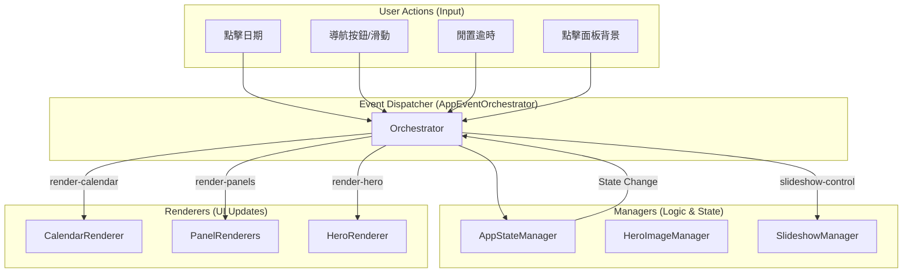
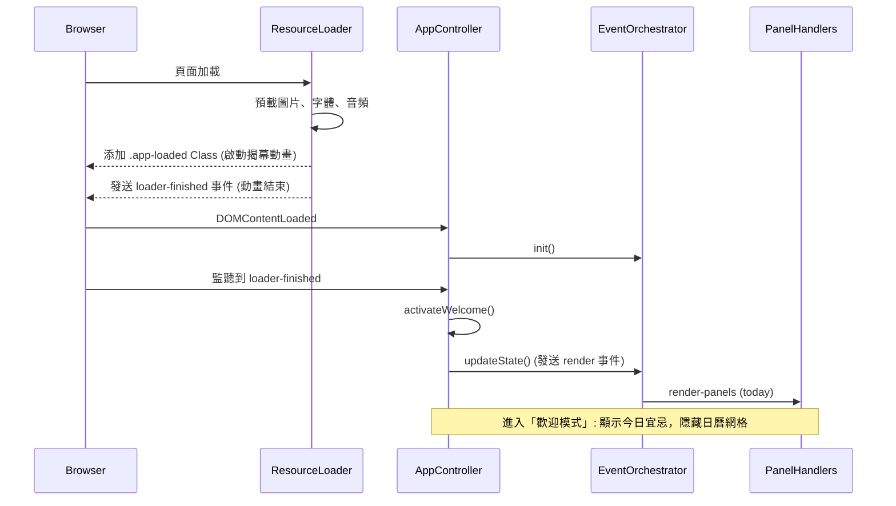

# UI Flow & Logic Architecture (UI 流程與邏輯架構)

本文件使用 Mermaid 圖表描述專案的 UI 狀態流轉與事件驅動邏輯。

## 1. 核心狀態流轉圖 (Core State Lifecycle)

```mermaid
stateDiagram-v2
    [*] --> Loading: 進入頁面
    Loading --> WelcomeMode: loader-finished
    
    state WelcomeMode {
        [*] --> TodayCard: 顯示今日宜忌
        TodayCard --> CalendarGrid: 點擊卡片/背景
        TodayCard --> ZenMode: 閒置 15s (自動)
    }
    
    state CalendarGrid {
        [*] --> MonthView
        MonthView --> DateDetail: 點擊日期
        MonthView --> NotePad: 點擊「隨筆」
        MonthView --> ArtworkMode: 點擊「映畫」
    }

    state ArtworkMode {
        [*] --> GalleryUI: 顯示換圖與選單
        GalleryUI --> CalendarGrid: 點擊「日曆」按鈕
    }

    state ZenMode {
        [*] --> Slideshow: UI 全部隱藏 (純淨背景)
        Slideshow --> Slideshow: 左右滑動切換
        
        Slideshow --> ReturnPrevious: 手動「日曆鍵」/ 觸碰螢幕
    }

    ReturnPrevious --> CalendarGrid: 如果從日曆進入
    ReturnPrevious --> ArtworkMode: 如果從映畫進入
    
    CalendarGrid --> ZenMode: 點擊「對焦框」/ 閒置 15s
    ArtworkMode --> ZenMode: 點擊「對焦框」/ 閒置 15s

    state UtilityLayout {
        Note 右上角組合: 音樂(右) > 沉浸(中) > 隨筆(左)
    }
```

## 2. 核心交互邏輯細節 (Interaction Rules)

### 2.1 沉浸模式 (Zen / Immersion) 進入與退出
*   **進入**：
    *   **手動**：點擊右上角「對焦框」按鈕。
    *   **自動**：全域閒置超時 (15秒) 自動觸發。
*   **退出 (喚醒)**：
    *   **手動**：點擊右上角「日曆圖示」(原對焦框切換) 或 背景。
    *   **行為**：應恢復進入 ZenMode 前的最後狀態（日曆網格 或 映畫控制項）。

### 2.2 狀態提示 (Visual Hints)
*   **沉浸按鈕 (右上中)**：
    *   未沉浸：圖示為「對焦框」，背景透明。
    *   沉浸中：圖示為「日曆表」，背景高亮 (金/白)。
*   **下方導航 (Dock)**：
    *   沉浸時淡出。
    *   喚醒後依據模式顯示金框 (日曆) 或 白框 (映畫)。
```

## 2. 事件驅動架構 (Event-Driven Architecture)

應用程式採用解耦的事件驅動模型，由 `EventOrchestrator` 擔任指揮官。



## 3. 初始化流程 (Initialization Sequence)



## 4. 文件維護說明
- **Mermaid 工具**: 建議使用 VS Code 的 Mermaid Preview 擴充功能查看。
- **邏輯變更**: 若修改 `src/scripts/app/` 下的控制項，請同步更新此圖表。
