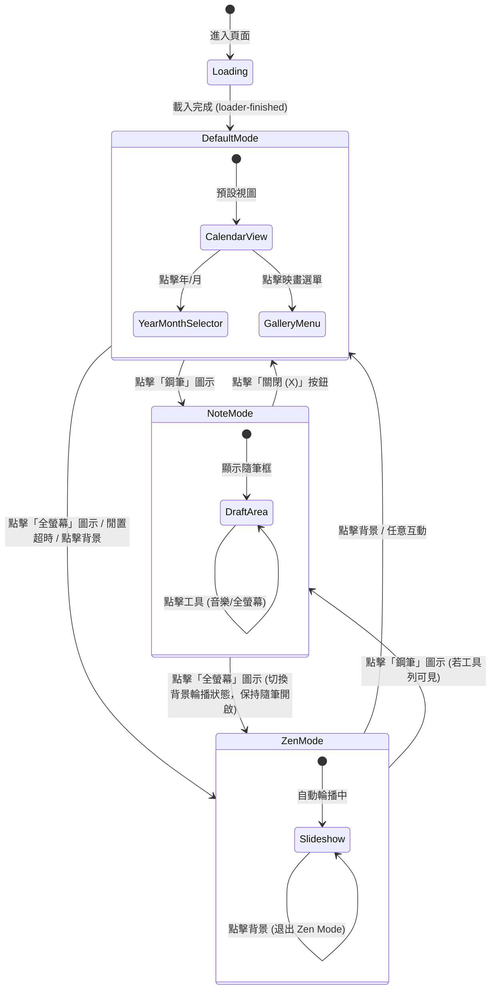

# UI Flow & Logic Architecture (UI 流程與邏輯架構)

此文件描述 "Lunar Calendar" 專案的核心 UI 狀態流轉、互動邏輯與設計哲學。

## 1. 核心設計哲學 (Core Design Philosophy)

本專案採用 **"雙重沉浸 (Dual Immersion)"** 架構，將使用者體驗分為兩個主要的專注維度：

1.  **創造專注 (Creation Focus / Note Mode)**:
    - **目的**: 捕捉當下靈感與心境。
    - **視覺**: 靜態背景 + 頂部工具列 + 魔砂白隨筆框。
    - **狀態**: `body.note-mode-active`
    - **互動**: 允許切換音樂、手動切換背景，但暫停自動輪播以減少干擾。

2.  **觀賞專注 (Viewing Focus / Zen Mode)**:
    - **目的**: 純粹的視覺享受與放鬆。
    - **視覺**: 全螢幕動態輪播背景。
    - **狀態**: `body.immersion-mode`
    - **互動**: 無 UI 干擾，點擊任意處喚醒或切換回主介面。

這兩種模式共享同一個底層邏輯：**隱藏繁雜資訊 (No Noise)**，僅保留與當下意圖相關的元素。

---

## 2. 狀態流轉圖 (State Lifecycle)

## 3. 詳細互動邏輯 (Interaction Logic)

### 3.1 隨筆模式 (Note Mode)
*   **觸發**: 點擊右上角 `btnPen`。
*   **UI 行為**:
    *   **隱藏**: `HeroDock` (底部導航), `HeroHeader` (日期資訊), `WelcomeOverlay` (歡迎紅包)。
    *   **顯示**: `NotePad` (隨筆框), `TopRightTools` (鋼筆, 全螢幕, 音樂), `HeroBackground`。
    *   **背景**: 預設為靜態，點擊背景或全螢幕按鈕可切換為 "Zen Mode (輪播)" 但不關閉隨筆框。
*   **CSS Class**: `body.note-mode-active`

### 3.2 沉浸模式 (Zen Mode / Immersion)
*   **觸發**: 
    *   手動: 點擊 `btnImmersion` (全螢幕圖示) 或 Default Mode 下的背景。
    *   自動: 閒置 15 秒。
*   **UI 行為**:
    *   **隱藏**: 所有 UI 面板 (含 Dock, Header)。
    *   **顯示**: 純背景輪播 (Slideshow)。
*   **CSS Class**: `body.immersion-mode`

### 3.3 預設主模式 (Default Mode)
*   **觸發**: 應用程式啟動、退出上述模式。
*   **UI 行為**: 完整顯示所有導航與資訊面板。

---

## 4. 事件驅動架構 (Event Orchestration)

系統使用 `CustomExample` 進行模組間通訊，避免強耦合。

| 事件名稱 (Event) | 來源 (Source) | 處理者 (Handler) | 描述 (Description) |
| :--- | :--- | :--- | :--- |
| `render-panels` | Logic | UIManager | 切換今日/年月面板顯示狀態。 |
| `close-panels` | Logic | UIManager | 強制關閉所有浮動面板 (如隨筆、選單)。 |
| `welcome-mode` | Interaction | IdleManager/UI | 切換沉浸模式 (`active: true/false`)。 |
| `slideshow-control`| Interaction | SlideshowManager | 控制背景播放 (`start`/`stop`)。 |
| `navigate-month` | Interaction | ImageManager | 切換月份導致的背景變更。 |

## 5. UI 層級規範 (Z-Index Hierarchy)

為了確保正確的覆蓋與互動，各層級定義如下：

1.  **HeroBackground**: `z-index: 1` (底層)
2.  **HeroHeader / Dock**: `z-index: 2000+` (主導航)
3.  **NotePad Overlay**: `z-index: 100000` (隨筆遮罩，需低於工具列)
4.  **Top Right Tools**: `z-index: 100001` (確保隨筆模式下可點擊)
5.  **WelcomeOverlay**: `z-index: 100005` (最高層遮罩)
